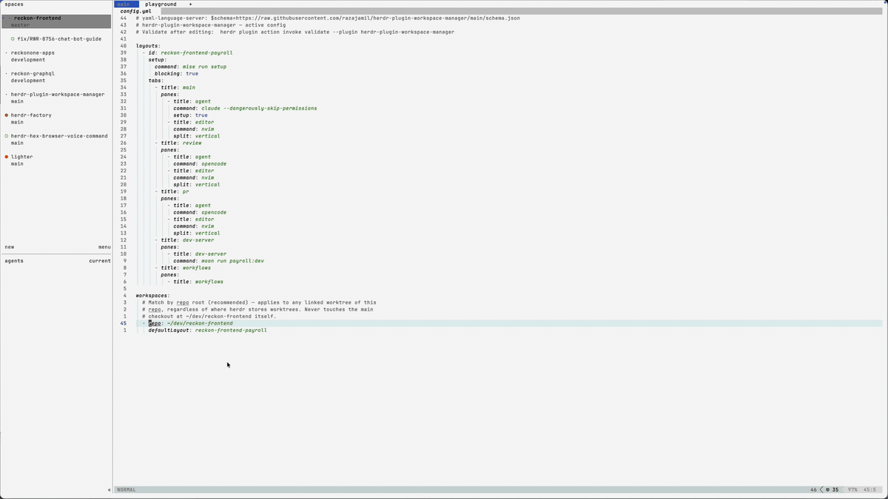

<div align="center">

# 🪟 herdr-plugin-workspace-manager

**Every new worktree, opened fully arranged.**

Define your tabs, panes, and startup commands once.
Every worktree you create opens straight into them —
and the merged ones clean up in one command.

[Install](#install) · [Quick start](#quick-start) ·
[Layouts by branch](#pick-a-layout-by-branch) ·
[Cleanup](#clean-up-merged-worktrees) · [Highlights](#highlights) · [Reference](#reference)

</div>



herdr-plugin-workspace-manager is a [herdr](https://herdr.dev) plugin that arranges
every new worktree into a declarative layout — and cleans up the ones you're done with:

- **Declarative layouts.** Tabs, panes, splits, and per-pane startup commands,
  defined once in YAML.
- **Applied automatically, per repo.** Point a repo at a layout and every new
  worktree — created from the CLI _or_ the herdr TUI — opens straight into it,
  fully arranged. No rebuilding your working view by hand each time.
- **Picked by branch.** Route `fix/*` branches to a trimmed layout and `docs/*`
  to another; the first matching rule wins.
- **Zero dependencies except Rust.** No Node, no npm — the plugin is a single
  native binary it compiles itself on first use, then runs with no runtime deps.
- **Cleanup after the merge.** `herdr-workspace-manager remove-gone` removes the
  worktrees whose upstream branch is gone, leaving the main checkout and
  anything in progress untouched.

## Install

Requires **herdr ≥ 0.7.0** and a **Rust toolchain** (`cargo`, [rustup.rs](https://rustup.rs))
on your `PATH`. The plugin compiles itself on first use — a one-off
`cargo build --release` — and runs as a single native binary from then on, with
no runtime dependencies at all.

```sh
herdr plugin install razajamil/herdr-plugin-workspace-manager
```

<details>
<summary>Local development / pinning / non-interactive</summary>

```sh
# live edits from a clone (the shim rebuilds automatically when src changes)
git clone https://github.com/razajamil/herdr-plugin-workspace-manager.git
herdr plugin link ./herdr-plugin-workspace-manager

# pin a release with --ref, or install non-interactively with --yes
herdr plugin install razajamil/herdr-plugin-workspace-manager --ref <tag> --yes
```

</details>

## Quick start

### 1. Drop a `config.yml` in the plugin's config directory

```sh
herdr plugin config-dir herdr-plugin-workspace-manager
# -> ~/.config/herdr/plugins/config/herdr-plugin-workspace-manager
```

```yaml
# yaml-language-server: $schema=https://raw.githubusercontent.com/razajamil/herdr-plugin-workspace-manager/main/schema.json
layouts:
  - id: web-app
    setup:
      command: make setup   # optional one-off, run before the rest of the layout
      blocking: true         # if true, no other panes spawn until it finishes
    tabs:
      - title: code
        panes:
          - title: agent
            command: claude    # optional command to run in the pane
            setup: true        # runs setup.command first, then `claude`
          - title: editor
            command: nvim
            split: vertical    # placed beside the agent pane
      - title: server
        panes:
          - title: dev
            command: make dev
          - title: shell
            split: horizontal  # stacked below the dev server
      - title: git
        panes:
          - title: lazygit
            command: lazygit

workspaces:
  - repo: ~/code/web-app       # any linked worktree of this repo gets the layout
    defaultLayout: web-app
```

The first line is a modeline: schema-aware editors autocomplete and validate the
file as you type (see [Editor autocomplete](#editor-autocomplete)). A fully
annotated template lives in [`config.example.yml`](./config.example.yml).

### 2. Create a worktree

Create a worktree for `~/code/web-app` — from the TUI or `herdr worktree create` —
and it opens with the `code` / `server` / `git` tabs already laid out, every pane
running its command.

## Pick a layout by branch

One layout rarely fits every kind of branch. `layoutMatching` picks the layout
from the new worktree's **branch** name — full working view for features, a
trimmed one for quick fixes:

```yaml
layouts:
  # …the web-app layout from the quick start, plus a trimmed variant:
  - id: web-app-hotfix
    tabs:
      - title: code
        panes:
          - title: agent
            command: claude
          - title: editor
            command: nvim
            split: vertical

workspaces:
  - repo: ~/code/web-app
    defaultLayout: web-app          # used when no rule matches
    layoutMatching:                 # first match wins — ordering is yours
      - title: Hotfix branches
        worktreePattern: fix/rwr-*  # glob over the whole branch: * = any chars, ? = one
        layout: web-app-hotfix
```

A worktree on a `fix/rwr-*` branch opens the trimmed layout; anything else gets
the `defaultLayout`. Details in [Per-branch layouts](#per-branch-layouts).

## Clean up merged worktrees

After a PR merges and its branch is deleted upstream, the local worktree
lingers. The bundled **`herdr-workspace-manager`** CLI removes the current
repo's linked worktrees whose upstream branch is gone:

```sh
herdr-workspace-manager remove-gone            # list them, then "Remove N worktree(s)? [y/N]"
herdr-workspace-manager remove-gone --dry-run  # just print the list, remove nothing
```

Safe by default: only branches that **had an upstream that was then deleted**
are candidates, and the main checkout, the workspace you run it from, and
anything with uncommitted changes are always skipped (see
[the `remove-gone` CLI](#the-remove-gone-cli)).

Installing the plugin doesn't put the CLI on your `PATH` — one command does
(it symlinks into `~/.local/bin`):

```sh
curl -fsSL https://raw.githubusercontent.com/razajamil/herdr-plugin-workspace-manager/main/install.sh | sh
```

Layouts work without the CLI — it's only needed for cleanup.

## Highlights

- **No runtime dependencies.** A single native Rust binary (including a small
  YAML-subset parser); the shim entrypoint builds it on first use, so a
  `herdr plugin link`-ed clone works with nothing but a Rust toolchain.
- **CLI and TUI worktrees both covered.** herdr emits different events for the
  two creation paths; the plugin subscribes to all of them and dedupes with an
  atomic claim, so a layout is applied exactly once per worktree.
- **Fresh worktrees only.** A layout only builds into a fresh (1-tab/1-pane)
  workspace and never touches the repo's main checkout — refocusing or restoring
  existing worktrees is a no-op.
- **Pane sizing.** Size any pane along its split axis with fixed cells
  (`size: 40`), a percentage (`"30%"`), or a fraction (`0.3`); splits default to
  50/50. See [Pane sizing](#pane-sizing).
- **Editor autocomplete.** The repo ships a JSON Schema — one modeline gets you
  completion, hover docs, and validation in any YAML-language-server editor.
- **On demand too.** `apply` and `validate` plugin actions (plus a
  `prefix+shift+l` keybinding) apply a layout or check your config any time.
- **Just the herdr CLI under the hood.** The result is ordinary tabs and panes,
  built exactly as if by hand — nothing proprietary to unwind.

---

# Reference

## Configuration

The plugin reads `config.yml` from the directory printed by
`herdr plugin config-dir herdr-plugin-workspace-manager`; a fallback path
`~/.herdr/plugins/herdr-plugin-workspace-manager/config.yml` also works, and
`HERDR_WSM_CONFIG` overrides the lookup entirely. A fully annotated template
lives in [`config.example.yml`](./config.example.yml).

| Field | Where | Meaning |
| --- | --- | --- |
| `layouts[].id` | layout | Unique id, referenced by `defaultLayout`. |
| `layouts[].setup.command` | layout | Optional command run on the `setup: true` pane. |
| `layouts[].setup.blocking` | layout | If `true`, no further tabs/panes spawn until setup finishes. |
| `tabs[].title` | tab | Tab label. The first tab reuses the worktree's existing tab. |
| `panes[].title` | pane | Pane label. |
| `panes[].command` | pane | Optional command to run in the pane. |
| `panes[].setup` | pane | Marks the single pane that runs `setup.command` (at most one per layout). |
| `panes[].split` | pane | For panes after the first: `vertical` \| `horizontal` \| `right` \| `down`. |
| `panes[].size` | pane | Optional size of **this** pane along the split axis: fixed cells (`40`), a fraction (`0.3`), or a percentage (`"30%"`). See [Pane sizing](#pane-sizing). |
| `panes[].ratio` | pane | Legacy split ratio `(0, 1)` — the fraction the **previous** pane keeps. Prefer `size` (mutually exclusive with it). |
| `workspaces[].repo` | workspace | **Recommended.** Repo root (`~` expanded) or bare repo name. Matches any *linked worktree* of that repo; the main checkout is never touched. |
| `workspaces[].path` | workspace | Alternative: prefix-match the worktree's checkout path. |
| `workspaces[].defaultLayout` | workspace | Layout id applied to a matching new worktree when no `layoutMatching` rule matches its branch. |
| `workspaces[].layoutMatching[]` | workspace | Optional ordered rules that pick a layout by the new worktree's **branch** name. First match wins. |
| `…layoutMatching[].worktreePattern` | rule | Glob matched against the whole branch name (`*` = any chars, `?` = one). e.g. `fix/rwr-*`. |
| `…layoutMatching[].layout` | rule | Layout id applied when this pattern matches. |
| `…layoutMatching[].title` | rule | Optional label (documentation only). |

Each `workspaces[]` entry needs `repo` and/or `path`; a `repo` match wins over a
`path` match.

### Per-branch layouts

Within a matched workspace, `layoutMatching` chooses a layout from the new
worktree's **branch** name. Rules are tried in the order you write them and the
first whose `worktreePattern` matches wins; if none match (or the worktree has
no branch, e.g. a detached HEAD) the `defaultLayout` applies. With neither a
matching rule nor a `defaultLayout`, nothing is applied. `worktreePattern` is a
glob over the entire branch name: `*` matches any run of characters (including
`/`) and `?` matches a single one, so `fix/rwr-*` matches `fix/rwr-142-login`
but not `hotfix/rwr-1`.

### Split direction

herdr splits are `right` or `down`. This plugin maps `vertical → right` (side
by side) and `horizontal → down` (stacked); `right`/`down` are also accepted.
The first pane of a tab is never split; each later pane splits from the
previous one.

### Pane sizing

By default each split is even (50/50). Give a pane a `size` to size **that**
pane along the split axis — columns for a `vertical`/`right` split, rows for a
`horizontal`/`down` split. `size` takes three forms:

| `size` value | Meaning |
| --- | --- |
| `40` (whole number) | **Fixed** — 40 cells (columns for a vertical split, rows for a horizontal one). |
| `"30%"` (string) | **Percentage** — 30% of the space being split. |
| `0.3` (0 < n < 1) | **Fraction** — the same as `"30%"`. |

```yaml
panes:
  - title: editor
  - title: sidebar
    split: vertical
    size: 40        # a 40-column sidebar
  - title: terminal
    split: horizontal
    size: "25%"     # bottom terminal takes 25% of the height
```

A percentage/fraction is applied directly. A **fixed** cell size is converted
to a ratio from the pane's *live* size at creation time — so it lands on ~N
cells when the layout is built; if you later resize the window, herdr
rebalances the panes proportionally (the plugin doesn't manage them
afterwards). A fixed size larger than the available space is clamped so both
panes stay visible.

`size` refers to the pane you put it on. The older `ratio` field is the
opposite — it's herdr's raw ratio, the fraction the **previous** pane keeps —
so `ratio: 0.3` makes the previous pane 30% and *this* pane 70%. `ratio` still
works but a pane can't set both; prefer `size`.

### Setup pane

At most one pane per layout may set `setup: true`. The setup command runs there
first; with `blocking: true` the hook waits for it to finish before building
anything else. After setup, that pane still runs its own `command`. Put the
setup pane first so nothing spawns ahead of it.

### Editor autocomplete

The repo ships a JSON Schema ([`schema.json`](./schema.json)). Editors backed
by the YAML Language Server — VS Code (Red Hat YAML extension), Neovim
(`yamlls`), Helix, etc. — give you completion, hover docs, and validation when
the file starts with this modeline (the bundled `config.example.yml` already
includes it):

```yaml
# yaml-language-server: $schema=https://raw.githubusercontent.com/razajamil/herdr-plugin-workspace-manager/main/schema.json
```

Or map it without editing the file, e.g. in VS Code `settings.json`:

```json
"yaml.schemas": {
  "https://raw.githubusercontent.com/razajamil/herdr-plugin-workspace-manager/main/schema.json": "**/herdr-plugin-workspace-manager/config.yml"
}
```

## Actions & keybinding

```sh
# Apply a layout to the current workspace (or pass a layout id):
herdr plugin action invoke apply --plugin herdr-plugin-workspace-manager

# Validate the config and print the resolved layouts/workspaces:
herdr plugin action invoke validate --plugin herdr-plugin-workspace-manager
```

A keybinding (`prefix+shift+l` → apply) is declared in the manifest.

## The `remove-gone` CLI

`herdr-workspace-manager` is a CLI bundled with the plugin, needed only for
cleanup — layouts work without it. It prints straight to your terminal, lists
the gone worktrees by workspace name, then asks for confirmation before
removing them:

```sh
# List the gone worktrees, then prompt "Remove N worktree(s)? [y/N]":
herdr-workspace-manager remove-gone

# Just print the list; remove nothing, no prompt:
herdr-workspace-manager remove-gone --dry-run

# Skip the prompt (for scripts); add --force to also remove dirty worktrees:
herdr-workspace-manager remove-gone --confirm --force
```

Pass `--workspace <id>` to target a repo other than the current pane's.

**Semantics.** A branch is only ever a candidate when it **had an upstream that
was then deleted** ("gone", in git's terms). Worktrees on branches that never
pushed/tracked a remote are left alone, as is the repo's main checkout. Removal
additionally **skips** (and reports) the workspace you run it from and — unless
`--force` — any worktree with uncommitted changes, so nothing in-progress is
destroyed silently. A clean worktree's committed history survives removal (it
stays in the repo's object store/reflog). A `git fetch --prune` runs first so
deleted branches are detected accurately; pass `--no-fetch` (or set
`HERDR_WSM_NO_FETCH=1`) to use cached refs.

**Installing it.** Installing the plugin doesn't put the CLI on your `PATH`;
the bundled [`install.sh`](./install.sh) symlinks it into `~/.local/bin`:

```sh
# From a clone of this repo:
./install.sh

# Or, if you installed the plugin and have no clone, fetch and run it:
curl -fsSL https://raw.githubusercontent.com/razajamil/herdr-plugin-workspace-manager/main/install.sh | sh
```

Link it elsewhere by passing a directory (`./install.sh ~/bin`); the installer
works whether the plugin is installed or linked, and warns if the target isn't
on your `PATH`. Then run `herdr-workspace-manager --help`.

**As a plugin action.** The preview is also exposed as a plugin action for the
TUI action menu / keybindings. It runs headless (no prompt) and removes
nothing — `action invoke` streams output to the plugin log rather than your
terminal, so the CLI is the way to actually remove worktrees:

```sh
herdr plugin action invoke remove-gone --plugin herdr-plugin-workspace-manager  # preview only
```

## Environment variables

| Var | Default | Purpose |
| --- | --- | --- |
| `HERDR_WSM_CONFIG` | — | Absolute path to a config file (overrides the default lookup). |
| `HERDR_WSM_PANE_READY_MS` | `700` | Delay before sending the first command to a freshly spawned pane (its shell needs a moment, or early keystrokes are dropped). |
| `HERDR_WSM_SETUP_TIMEOUT_MS` | `600000` | Max wait for a blocking setup command to finish. |
| `HERDR_WSM_NO_FETCH` | — | If set, `remove-gone` skips the `git fetch --prune` and uses cached remote-tracking refs. |

## How it works

The plugin subscribes to **three** events, because herdr creates worktrees two
different ways and they emit different events to plugins:

| You create a worktree via… | herdr emits to plugins |
| --- | --- |
| `herdr worktree create` (CLI / socket API) | `worktree.created` **and** `workspace.created` |
| the **TUI** right-click "new worktree" (in-app) | **only** `workspace.focused` (it focuses the new worktree on creation) |

So the hook listens for `worktree.created`, `workspace.created`, **and**
`workspace.focused`. On any of them it:

1. Loads the config and resolves the focused/created workspace id.
2. **Queries** that workspace for its worktree facts (the `workspace.focused`
   payload carries only an id).
3. Skips unless it's a **linked worktree** (never the repo's main checkout).
4. Matches against `workspaces[]` by **repo** (`repo_root`/`repo_name`) or path,
   then picks the layout: the first `layoutMatching` rule whose glob matches the
   worktree's **branch**, else the workspace's `defaultLayout`.
5. Only builds into a **fresh** (1-tab/1-pane) workspace.
6. **Dedupes** with an atomic claim (the events can fire together; also skips
   restored worktrees after a restart) — applied exactly once per worktree.
7. Walks the chosen layout **depth-first**, driving the herdr CLI to build it —
   exactly as if you'd done it by hand.

> **Note on `workspace.focused`.** It fires on every workspace switch, so the
> hook runs a tiny check each time (a "decided" cache makes repeat focuses a
> no-op). A side effect: focusing a *fresh, empty* worktree of a configured repo
> applies its layout (once) — which is exactly how the TUI flow works, since the
> TUI focuses the new worktree on creation. To turn off the focus trigger, remove
> the `[[events]] on = "workspace.focused"` block from the manifest; `herdr
> worktree create` still works via the other two events.

```
 new worktree (CLI or TUI) ──► event hook (herdr-workspace-manager event)
        ▼
   load config ─► match workspaces[] (repo or path) ─► default layout
        │                                                   │
        └── no match / not fresh / already done ─► no-op     ▼
                                          depth-first walk → herdr tab/pane CLI:
                                            tab 0  → reuse the worktree's root tab + pane
                                            tab N  → herdr tab create
                                            pane J → herdr pane split <prev pane>
                                            each pane → rename + run command
                                            setup pane → run setup (blocking? wait) then its command
```

Because it's just the herdr CLI under the hood, the result is a set of ordinary
panes — the plugin doesn't manage their lifecycle afterwards.

## Trust & security

A herdr plugin is ordinary code that runs on your machine with your environment
and can call the full herdr CLI. This plugin runs the commands you put in your
`config.yml` (e.g. `make setup`, `nvim`) in your worktrees. Review the manifest
and `config.yml` before use — you control exactly what runs.

## Notes & limitations

- The first tab/pane of a layout reuses the worktree's existing root tab/pane;
  additional tabs/panes are created.
- Layouts are applied additively; the plugin does not tear panes down.
- A single Rust binary with no runtime dependencies (includes a small
  YAML-subset parser). The `bin/herdr-workspace-manager` shim compiles it on
  first use, so it works under `herdr plugin link` with just a Rust toolchain.

## Development

```sh
cargo test                                    # unit tests + integration test
cargo test --bin herdr-workspace-manager      # unit tests only (no herdr needed)
cargo test --test integration                 # live: creates a real herdr worktree and drives the hook end-to-end
```

The integration test auto-skips when no herdr server is running; otherwise it
creates a throwaway git repo + a real linked worktree, drives the real
`workspace.focused` hook, and asserts the tab/pane structure, that each pane
command actually ran (via marker files), blocking-setup ordering, and
idempotency — then cleans everything up.

This repo is a self-contained herdr plugin (a `herdr-plugin.toml` manifest plus
a Rust crate). To list it in the herdr marketplace, the GitHub repo carries the
`herdr-plugin` topic; anyone can then `herdr plugin install <owner>/<repo>`. Unit
tests run in CI (`.github/workflows/ci.yml`); the integration test auto-skips
there and needs a local herdr server to run for real.

## Credits

The declarative layout config is inspired by [workmux](https://github.com/raine/workmux).

## License

[MIT](./LICENSE) © Raza Jamil
